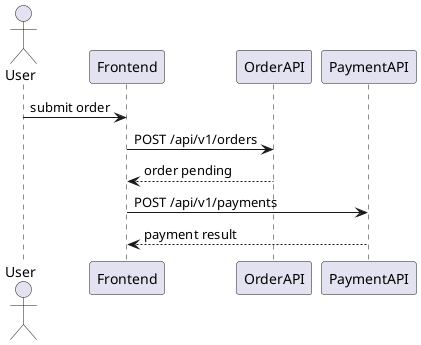
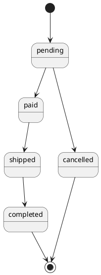
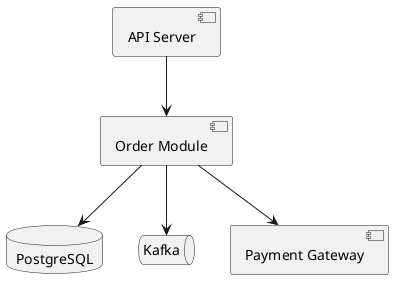
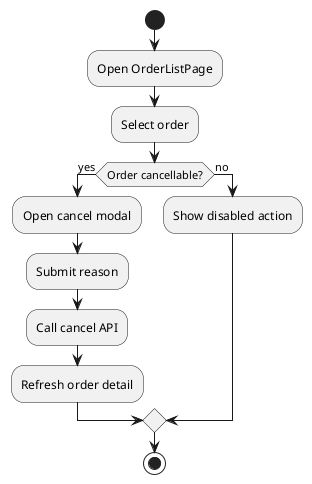

# ShipKit 三个设计技能优化建议方案

## 1. 目标

本方案用于打磨以下三个技能：

- `skills/ship-contract`
- `skills/ship-backend-design`
- `skills/ship-frontend-design`

核心目标：让三个设计阶段在简单项目中保持轻量，在复杂项目中能稳定产出完整、详细、可评审、可实现、可验证的设计文档。

本方案不要求立刻修改 skill 文件，仅作为优化建议和后续改造依据。

## 2. 审计依据

本次分析读取了以下文件：

- `skills/ship-contract/SKILL.md`
- `skills/ship-contract/references/api-contract-template.md`
- `skills/ship-backend-design/SKILL.md`
- `skills/ship-backend-design/references/backend-design-template.md`
- `skills/ship-frontend-design/SKILL.md`
- `skills/ship-frontend-design/references/frontend-design-template.md`

当前三个 skill 的基础较完整：

- 都有 `When to Use`、`When NOT to Use`、`Process`、`Output`、`Verification`、`Red Flags`。
- `ship-contract` 已覆盖 REST、gRPC、message、cron、cli、sdk 等多种 contract form。
- `ship-backend-design` 已强调 Domain 到 Module、Service、Repository、DB 的实现链路。
- `ship-frontend-design` 已强调 UI evidence、Page Tree、Page-API Mapping、状态管理和路由权限。
- 三者都能承接 `requirements.md`、`tech-selection.md`、`api-contract.md`、`referenced_spec_ids` 等上下游信息。

主要缺口：

- 图示要求不统一。`backend-design` 提到 ER 图，`frontend-design` 提到数据流向图，但没有统一的 PlantUML 使用协议。
- 缺少“什么时候推荐画图”的触发条件，复杂项目容易只产出文字和表格。
- 三个 skill 的 traceability 链路还不够强，Contract、Backend、Frontend 之间缺少统一对齐矩阵。
- 服务交互、异步消息、业务流程、状态机、权限流、错误流、部署运行时边界等复杂信息表达不足。
- Verification 目前偏单文档 checklist，缺少文档内部一致性和三份文档互相一致性的检查项。

## 3. 总体优化方向

建议新增一套跨三个 skill 共享的 `Design Diagram & Traceability Protocol`。

原则：

- 简单项目不强制画图。
- 复杂项目推荐使用 PlantUML 辅助表达。
- 图必须服务于设计决策，不画装饰性图。
- 图中的页面、接口、服务、事件、状态必须与正文表格保持一致。
- 若复杂场景未画图，应在文档中说明原因。

复杂项目推荐画图的触发条件：

- 涉及 3 个以上业务域或模块协作。
- 涉及异步消息、队列、事件、定时任务。
- 涉及跨服务调用、第三方系统、支付、通知、审核、风控等外部依赖。
- 涉及明显状态流转，例如订单、审批、任务、工单、支付、发布流程。
- 涉及复杂权限、角色、组织层级、数据隔离。
- 涉及前端多页面共享状态、复杂表单、多步骤向导、实时刷新。
- 涉及高风险事务、一致性、补偿、幂等、重试。
- 评审者仅靠表格难以快速理解流程。

推荐支持的 PlantUML 图类型：

| 信息类型 | 推荐图类型 |
|---|---|
| 业务流程 / 用户路径 | activity diagram |
| 服务交互 / 接口调用 | sequence diagram |
| 系统边界 / 模块关系 | component diagram |
| 数据模型 / 表关系 | entity relationship style class diagram |
| 状态流转 | state diagram |
| 部署 / 运行时拓扑 | deployment diagram |
| 权限 / 角色关系 | class diagram 或 object diagram |
| 前端状态流 | component diagram + sequence/activity diagram |
| 异步消息流 | sequence diagram 或 component diagram |

## 4. 三个 Skill 的统一增强建议

### 4.1 增加 `Diagram Guidance`

建议三个 `SKILL.md` 都增加一个小节：

```markdown
## Diagram Guidance

复杂项目建议使用 PlantUML 辅助表达设计，但不要求简单项目强制画图。

推荐画图场景：
- 多业务域 / 多服务 / 多页面协作
- 异步消息、定时任务、事件驱动
- 复杂状态机、审批流、订单流、支付流
- 跨系统集成、第三方依赖
- 权限模型、组织层级、数据隔离
- 事务、补偿、幂等、重试链路较复杂

图示要求：
- 图必须服务于设计决策，不画装饰性图。
- 图下方必须补充关键说明：范围、参与方、关键路径、异常路径、未覆盖范围。
- 图中的模块、接口、事件、页面名称必须与正文表格保持一致。
- 若复杂场景未画图，应说明原因。
```

### 4.2 模板增加 `Diagrams / Visual Aids` 章节

建议三个 reference template 都增加可选章节：

```markdown
### Diagrams / Visual Aids

复杂项目建议补充 PlantUML 图示。每张图必须说明：

- 范围：图覆盖什么，不覆盖什么。
- 参与方：页面、服务、数据库、消息队列、第三方系统等。
- 关键路径：主要 happy path。
- 异常路径：关键失败、重试、补偿、权限拒绝等。
- 一致性检查：图中的名称是否与本文表格、contract、backend/frontend design 保持一致。
```

### 4.3 增加跨文档 Traceability Matrix

建议三个技能统一维护以下追踪链：

```text
Requirement Domain ID
→ AC ID
→ Contract operation / event / task
→ Backend handler / service / repository / storage
→ Frontend page / user action / state
→ Verification item / test scenario
```

推荐矩阵：

```markdown
| Domain ID | AC ID | Contract | Frontend Page/Action | Backend Implementation | Test Focus |
|---|---|---|---|---|---|
| D-ORD-001 | AC-ORD-001 | POST /api/v1/orders | CheckoutPage.submit | OrderController.create → OrderService.createOrder | 创建成功、库存不足、重复提交 |
```

价值：

- 防止 contract 有接口但 frontend/backend 没有承接。
- 防止 frontend 调用未定义 contract。
- 防止 backend 实现路径遗漏 AC。
- 为后续测试计划提供直接输入。

### 4.4 增加图示一致性检查

建议三个 skill 的 Verification 增加：

```text
□ 复杂场景是否已补充 PlantUML 图示，或说明不画图原因？
□ 图中的接口是否存在于 api-contract.md？
□ 图中的 Service / Repository / Event 是否存在于 backend-design.md？
□ 图中的页面 / 用户操作 / 状态是否存在于 frontend-design.md？
□ 图中的状态值是否与 Shared Models / enum 一致？
□ 图示是否覆盖关键异常路径，而不只是 happy path？
```

## 5. `ship-contract` 优化建议

### 5.1 当前定位

`ship-contract` 是三者的共享事实源，负责定义接口、消息、任务、SDK、错误码、共享模型和兼容性策略。

当前已覆盖多种 contract form，但复杂业务流程、调用方关系、状态机、幂等与重试策略还可以更显式。

### 5.2 增加 Consumer / Provider Matrix

建议在 contract 文档中增加调用关系矩阵：

```markdown
| Contract | Provider | Consumer | Entrypoint | AC ID | 调用时机 | 是否阻塞主流程 |
|---|---|---|---|---|---|---|
| POST /api/v1/orders | OrderService | CheckoutPage | submit order | AC-ORD-001 | 用户提交 | 是 |
| orders.created.v1 | OrderService | NotificationWorker | event consume | AC-NOTIF-001 | 下单成功后 | 否 |
```

价值：

- 统一 REST、gRPC、message、cron、cli、sdk 的消费者视角。
- 明确谁提供、谁消费、何时调用。
- 为 frontend/backend design 提供承接依据。

### 5.3 增加 Business Flow Contract

复杂业务建议不只列接口，还描述接口顺序和业务路径。

推荐使用 sequence diagram：



图下方应说明：

- 哪些接口属于本 contract。
- 哪些调用是同步阻塞。
- 哪些异常路径必须有错误码。
- 哪些步骤允许重试或补偿。

### 5.4 增加 State Contract

对有状态对象，contract 应明确状态迁移，不只定义 enum。

推荐内容：

```markdown
### Order Status State Machine

- `pending` → `paid`
- `pending` → `cancelled`
- `paid` → `shipped`
- `shipped` → `completed`

非法状态迁移必须返回 `409xx`。
```

复杂项目推荐配 PlantUML state diagram：



### 5.5 强化 Compatibility / Versioning

当前已有 changelog 和 breaking / non-breaking / additive 分类，建议补充更明确规则：

- 新增 response 字段是否必须 optional。
- 新增 request 必填字段是否一定是 breaking。
- enum 新增值是否会破坏前端 switch exhaustiveness。
- error code 新增是否需要前端默认处理。
- message topic 是否允许原地升级，还是必须发 `v2` topic。
- SDK public API 的 deprecation 周期。

### 5.6 强化 Error Handling Contract

建议错误码表增加以下列：

```markdown
| 错误码 | HTTP/gRPC Code | 触发条件 | 用户可恢复 | 是否可重试 | 前端处理 | 后端日志级别 |
|---|---|---|---|---|---|---|
```

价值：

- 前端知道是展示字段错误、toast、跳转登录、刷新页面，还是允许重试。
- 后端知道该记 `warn` 还是 `error`，是否需要告警。
- 测试能直接覆盖异常路径。

### 5.7 标准化 Idempotency / Retry Contract

对写接口、消息消费、定时任务，建议增加：

```markdown
| Contract | 幂等要求 | 幂等键来源 | 重复请求行为 | 超时后是否可重试 | 冲突响应 |
|---|---|---|---|---|---|
```

适用场景：

- 创建订单、支付、提交审批、创建导入任务。
- message consumer。
- cron / batch job。
- CLI 执行有副作用命令。

## 6. `ship-backend-design` 优化建议

### 6.1 当前定位

`ship-backend-design` 负责把 `api-contract.md` 落到后端实现路径，包括模块边界、领域模型、数据模型、Service、Repository、事务、横切关注点。

当前实现链路较清楚，但复杂服务交互、运行时拓扑、事务补偿、事件一致性和安全边界可以进一步增强。

### 6.2 增加 Runtime Component Diagram

复杂后端项目推荐画 component diagram：



正文说明：

- 哪些是本系统组件。
- 哪些是外部依赖。
- 哪些调用同步，哪些异步。
- 哪些依赖在主流程关键路径上。
- 哪些依赖失败后允许降级或补偿。

### 6.3 增加 Transaction / Consistency Matrix

建议将事务边界表格化：

```markdown
| 操作 | 涉及聚合 | 事务边界 | 一致性要求 | 失败补偿 | 幂等策略 |
|---|---|---|---|---|---|
| 创建订单 | Order, Inventory | Order 单事务 + 库存异步预占 | 最终一致 | 释放库存事件 | request_id |
```

价值：

- 避免用一句“加事务”掩盖真实一致性问题。
- 明确跨聚合强一致是否真的必要。
- 为测试异常路径提供依据。

### 6.4 增加 Service Interaction Protocol

后端设计不应只列 Service 方法，还应明确服务间交互策略：

```markdown
| 调用方 | 被调用方 | 调用方式 | 超时 | 重试 | 熔断/降级 | 错误映射 |
|---|---|---|---|---|---|---|
```

适用场景：

- 微服务调用。
- 第三方 API。
- 内部模块 gateway。
- 跨进程 worker。

### 6.5 增加 Domain Event / Message Design

如果 `api-contract.md` 中包含 message contract，backend-design 必须承接：

```markdown
| Event | Producer | Consumer | 触发事务点 | Outbox | Retry | DLQ |
|---|---|---|---|---|---|---|
```

建议明确：

- 是否使用 outbox pattern。
- 事件何时产生：事务前、事务内、事务后。
- 事件 payload 与 contract schema 是否一致。
- 消费端如何幂等。
- 失败是否进入 DLQ。

### 6.6 增加 Data Lifecycle / Retention

当前已有审计字段和软删除建议，复杂项目还应补充：

- 数据归档策略。
- PII 脱敏。
- 删除与恢复策略。
- 数据保留周期。
- 审计日志不可变性。
- 多租户数据隔离。
- 敏感字段加密策略。

建议表格：

```markdown
| 数据对象 | 敏感级别 | 保留周期 | 删除策略 | 脱敏/加密 | 审计要求 |
|---|---|---|---|---|---|
```

### 6.7 强化 Security Design

建议将安全从横切关注点中单独拆出，至少覆盖：

- AuthN：认证方式。
- AuthZ：RBAC / ABAC / owner check。
- Tenant isolation：租户隔离。
- Sensitive data：敏感字段加密 / 脱敏。
- Audit：关键操作审计。
- Abuse prevention：限流、防刷、防重放。
- Dependency security：依赖漏洞扫描。

### 6.8 增加 Read / Write Path Design

复杂查询、报表、搜索场景建议区分读写路径：

```markdown
| 场景 | 写模型 | 读模型 | 缓存 | 索引 | 一致性延迟 |
|---|---|---|---|---|---|
```

适用场景：

- CQRS。
- Elasticsearch / OpenSearch。
- Redis 缓存。
- 报表宽表。
- 高并发列表查询。

## 7. `ship-frontend-design` 优化建议

### 7.1 当前定位

`ship-frontend-design` 负责从 UI/UX evidence 和 `api-contract.md` 出发，设计页面树、组件分层、页面接口映射、状态管理、路由权限和前端非功能方案。

当前对 Page-API Mapping 要求较强，但复杂用户流程、UI 状态矩阵、权限 UX、设计证据质量和前端数据所有权可以进一步增强。

### 7.2 增加 User Flow Diagram

复杂页面流推荐使用 activity diagram：



适用场景：

- 多步骤表单。
- 审批流。
- 支付流。
- 注册登录。
- 导入导出。
- 复杂筛选和批量操作。

### 7.3 增加 UI State Matrix

建议每个关键页面写状态矩阵：

```markdown
| 页面 | 状态 | 触发条件 | UI 表现 | 可执行操作 |
|---|---|---|---|---|
| OrderListPage | loading | 初次请求 | skeleton | 不可筛选 |
| OrderListPage | empty | items=[] | empty state | 可清空筛选 |
| OrderListPage | error | API 失败 | error block + retry | 可重试 |
```

状态建议至少覆盖：

- initial。
- loading。
- empty。
- error。
- partial success。
- optimistic update。
- permission denied。
- offline / network unstable。

### 7.4 强化 Frontend Data Ownership

建议明确区分：

- URL state：筛选、分页、tab、排序。
- local state：弹窗、表单临时输入、hover/expanded。
- server state：列表、详情、缓存、mutation 状态。
- global app state：用户、权限、全局配置、主题。
- derived state：由已有状态计算，不落 store。

推荐表格：

```markdown
| 状态 | Owner | 存储位置 | 更新来源 | 是否持久化 | 不变量 |
|---|---|---|---|---|---|
```

价值：

- 避免把表单临时状态放进 global store。
- 避免跨页面共享状态通过 props drilling 硬传。
- 让 React Query / SWR / store 的职责边界更清楚。

### 7.5 增加 Page-to-Contract Bidirectional Coverage

当前已有页面接口映射，建议增加反向校验：

```markdown
| 页面操作 | 使用接口 | contract 是否存在 | 错误码是否覆盖 | loading/empty/error 是否设计 |
|---|---|---|---|---|
```

价值：

- 防止页面调用未定义接口。
- 防止 contract 定义了接口但没有任何页面使用。
- 防止错误码存在但 UI 没有处理。

### 7.6 增加 Permission UX

前端不能只写 route guard，建议补充权限 UX 表：

```markdown
| 权限场景 | 页面/组件表现 | 接口错误 | 前端处理 |
|---|---|---|---|
| 未登录 | redirect login | 401 | 保存 redirectTo |
| 无权限 | hidden / disabled / action denied | 403 | 展示无权限页 |
| 数据不可见 | empty or masked | 404 / 403 | 不泄漏资源存在性 |
```

### 7.7 增加 Design Evidence Quality

当前要求 UI/UX 资料，但建议区分证据等级：

```markdown
| 页面 | 证据等级 | 来源 | 缺失信息 | 采用假设 |
|---|---|---|---|---|
| OrderListPage | high | Figma final design | 无 | 无 |
| OrderDetailPage | medium | screenshot | hover state 缺失 | 复用组件库默认 |
| ImportWizardPage | low | wireframe | 视觉样式待定 | 仅用于结构评审 |
```

证据等级建议：

- `high`：Figma final design / design system / 完整交互说明。
- `medium`：截图 / 原型 / 局部设计稿。
- `low`：wireframe / 用户口述 / 暂存假设。

### 7.8 强化 Accessibility / Responsive Detail

建议不要只列“语义化 HTML、ARIA”，而是按页面或关键组件补充：

```markdown
| 页面/组件 | Keyboard | Screen Reader | Focus | Contrast | Mobile Behavior |
|---|---|---|---|---|---|
```

适用组件：

- Modal。
- Dropdown。
- Table。
- Form。
- Toast。
- Date picker。
- Drag and drop。

## 8. PlantUML 落地规范建议

### 8.1 推荐最小策略

- `ship-contract`：复杂业务推荐画业务流程图、调用时序图、状态机。
- `ship-backend-design`：复杂服务推荐画组件图、ER 图、服务交互时序图。
- `ship-frontend-design`：复杂交互推荐画用户流程图、页面状态流、数据流图。

### 8.2 推荐格式

````markdown
### Diagram: Order Cancellation Flow


**说明**
- **范围**：只覆盖用户主动取消订单。
- **关键路径**：页面提交 → API 校验 → 状态更新 → 返回最新快照。
- **异常路径**：订单已发货返回 `40901`。
- **不覆盖**：客服后台强制取消。
````

### 8.3 图示质量要求

- 图示名称要具体，避免 `System Flow` 这类泛名。
- 图中的 node 名称要与正文中的 page、service、contract、event 名称一致。
- 图必须至少覆盖一个关键异常路径，不能只有 happy path。
- 图下方必须写说明，否则图容易变成不可维护的装饰。
- 不要求渲染图片入库；Markdown 中保留 PlantUML source 即可。

## 9. 优先级建议

### P0：建议优先补

- 三个 skill 增加统一 `Diagram Guidance`。
- 三个 template 增加可选 `Diagrams / Visual Aids` 章节。
- 增加复杂项目推荐画图的触发条件。
- 增加跨文档 `Traceability Matrix` 要求。
- Verification 增加图示与正文一致性、三份设计互相一致性检查。

### P1：增强复杂项目表达力

- `ship-contract` 增加 Consumer / Provider Matrix、State Contract、Idempotency Matrix。
- `ship-backend-design` 增加 Transaction / Consistency Matrix、Service Interaction、Domain Event / Outbox。
- `ship-frontend-design` 增加 UI State Matrix、Permission UX、Design Evidence Quality。

### P2：增强可运行和可测试性

- 三个 skill 都补 Test Focus / Verification Scenario。
- `ship-contract` 补机器可读产物更明确的输出路径，例如 OpenAPI、JSON Schema、Zod、proto、Avro。
- `ship-backend-design` 补 observability 指标、告警、运行时容量假设。
- `ship-frontend-design` 补前端埋点、性能预算、可访问性测试点。

## 10. 建议的验收标准

如果后续按本方案修改三个 skill，建议用以下标准验收：

- 简单项目仍可轻量产出，不会因为 PlantUML 要求被迫画无意义图。
- 复杂项目有明确触发条件，agent 知道什么时候推荐画图。
- 三个设计文档能通过 `Domain ID / AC ID / Contract / Page / Service / Test Focus` 串起来。
- Contract 中每个关键接口、事件、任务都有 consumer/provider 视角。
- Backend 中每个关键接口都能落到 handler/service/repository/storage，并说明事务和一致性。
- Frontend 中每个关键页面操作都能落到 contract，并说明 loading/empty/error/permission 状态。
- 图示与正文表格一致，不产生新的事实源分裂。

## 11. 总结

这三个技能当前基础较好，不建议推倒重写。最佳改造方式是做协议层增强：统一图示规则、统一复杂度触发条件、统一追踪矩阵，再分别补充 contract、backend、frontend 的专项矩阵。

这样可以保持简单项目轻量，同时让复杂项目能够完整表达业务流程、服务交互、状态流转、异常路径、权限和一致性边界。
