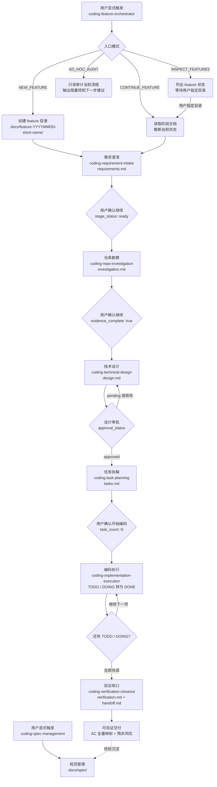

# AI Coding Skills — Coding Feature Workflow

> 一套 explicit opt-in 的 AI 辅助编码工作流，把需求从输入资料推进到可验证交付。

## 安装

```bash
npx skills add MuJianxuan/ai-feature-coding
```

## 技能体系概览

本仓库包含 8 个协作 skill，由 `coding-feature-orchestrator` 统一调度：

| 阶段 | Skill | 产物 | 职责 |
| --- | --- | --- | --- |
| 总调度 | `coding-feature-orchestrator` | route payload | 入口判断、阶段推断、路由分发 |
| 需求澄清 | `coding-requirement-intake` | `requirements.md` | 把输入变成可验证的 scope 和 acceptance criteria |
| 仓库勘察 | `coding-repo-investigation` | `investigation.md` | 找真实代码链路、数据来源、接口行为 |
| 技术设计 | `coding-technical-design` | `design.md` | 写可拆任务的技术方案 |
| 任务拆解 | `coding-task-planning` | `tasks.md` | 拆成原子、可验证、按依赖排序的任务 |
| 编码执行 | `coding-implementation-execution` | 代码改动 + 交付记录 | 按 tasks.md 逐项执行 |
| 验证收口 | `coding-verification-closeout` | `verification.md` + `handoff.md` | AC 映射验证、交付总结 |
| 规范管理 | `coding-spec-management` | `.docs/spec/` | 沉淀编码规范 |

### 流程线框图



### 核心设计原则

- **Explicit opt-in**：普通编码/调试/设计不会自动触发工作流
- **一次一步**：默认每次只推进一个阶段，跨阶段需用户确认
- **证据驱动**：每个阶段产物必须有真实证据支撑，不允许猜测
- **设计审批门禁**：design → tasks 之间有硬门禁，需用户明确批准
- **可恢复**：中断后可通过 DOING 状态精确恢复

## 使用场景

### 场景一：0-1 新建 Feature（Greenfield）

适用于全新功能开发，从需求到交付的完整流程。

**启动命令：**

```text
使用 coding-feature-orchestrator，为"<功能名>"启动一条新的 Coding Feature Workflow：<需求描述>
```

**完整推进流程：**

```
1. 需求澄清 → 产出 requirements.md (stage_status: ready)
   用户确认 ↓
2. 仓库勘察 → 产出 investigation.md (stage_status: ready)
   用户确认 ↓
3. 技术设计 → 产出 design.md (stage_status: ready, approval_status: pending)
   用户批准设计 ↓
4. 任务拆解 → 产出 tasks.md (stage_status: ready, task_count: N)
   用户确认 ↓
5. 编码执行 → 逐个任务执行 (TODO → DOING → DONE)
   每个任务完成后停下，用户确认继续 ↓
6. 验证收口 → verification.md + handoff.md (stage_status: complete)
```

**推进话术：**

| 阶段转换 | 用户说 |
| --- | --- |
| 需求 → 勘察 | "继续下一阶段" |
| 勘察 → 设计 | "继续下一阶段" |
| 设计 → 任务 | "批准设计，继续任务拆解" |
| 任务 → 编码 | "开始编码" / "执行第一个任务" |
| 编码下一项 | "继续执行下一个任务" |
| 编码 → 验证 | "进入验证收口" |

### 场景二：迭代已有 Feature（Iteration）

适用于继续推进中断的工作、恢复 DOING 任务、或在已有 feature 基础上补充。

**继续命令：**

```text
使用 coding-feature-orchestrator，继续 .docs/feature-YYYYMMDD-short-name/
```

**恢复中断任务：**

```text
使用 coding-feature-orchestrator，恢复 .docs/feature-YYYYMMDD-short-name/ 的当前 DOING 任务
```

**查看所有 feature 状态：**

```text
使用 coding-feature-orchestrator
```

（无指定目录时进入 INSPECT_FEATURES 模式，列出所有 feature 目录状态）

**直接调用某阶段：**

```text
使用 coding-task-planning，基于 .docs/feature-20260509-example/ 的 design.md 拆 tasks.md
```

## 最佳实践

### 启动前

1. **明确触发意图** — 只有确实需要完整工作流时才启动；简单 bug fix 或小改动直接做
2. **准备需求资料** — PRD、原型图、会议纪要放到 `resource/` 目录，越完整需求澄清越快
3. **一个 feature 一个目录** — 不要混合多个不相关需求到同一个 feature 目录

### 推进中

4. **不要跳阶段** — 每个阶段的产物是下一阶段的输入，跳过会导致证据断裂
5. **设计必须审批** — 仔细 review design.md 再批准，这是最后一道防线
6. **任务粒度适中** — 每个任务应该能在一次对话中完成并验证
7. **及时记录 scope 变化** — 发现需要扩大范围时走 scope change 流程，不要偷偷加
8. **保持 metadata 一致** — `updated_at`、`evidence_complete`、`task_count` 必须与内容同步

### 验证收口

9. **验证要映射 AC** — 每条 acceptance criteria 都要有对应的验证证据
10. **失败不隐藏** — FAIL/BLOCKED 写入残余风险，不要伪装成 PASS
11. **handoff 要完整** — 配置/SQL/部署事项即使没有也要显式写"无"

### 常见反模式

| 反模式 | 正确做法 |
| --- | --- |
| 普通 bug 排查触发工作流 | 只有显式指定 skill 才触发 |
| 设计 ready 就直接拆任务 | 等用户明确批准 |
| 一个任务完成后自动执行下一个 | 停下等用户确认 |
| 用"已完成"作为交付记录 | 写改动文件、验证命令、结果、残余风险 |
| 验证只看 design.md | 必须结合 investigation.md 的真实链路 |

## Feature 目录结构

```
.docs/feature-YYYYMMDD-short-name/
├── README.md              # 目录说明
├── requirements.md        # 需求、scope、验收标准
├── investigation.md       # 仓库证据、代码链路
├── design.md              # 技术方案、影响范围
├── tasks.md               # 任务清单（唯一编码驱动文件）
├── verification.md        # 验收映射
├── handoff.md             # 交付总结
├── resource/              # 需求资料
│   └── README.md
└── sql/                   # SQL 草案
    ├── DDL.sql
    ├── DML.sql
    └── ROLLBACK.sql
```

## 阶段文档 Metadata

每个阶段文档都有 YAML frontmatter：

```yaml
---
feature_stage: requirements  # requirements/investigation/design/tasks/verification/handoff
stage_status: draft          # draft/ready/blocked (前4阶段) 或 draft/blocked/complete (后2阶段)
updated_at: "2026-05-11T10:00:00+08:00"
evidence_complete: false
---
```

`design.md` 额外包含审批字段：

```yaml
approval_status: pending     # pending/approved/blocked
approved_by: ""
approved_at: ""
approval_evidence: ""
```

## 维护

修改任何 skill 后运行 smoke test：

```bash
python3 skills/coding-feature-orchestrator/scripts/validate_coding_skills.py
```

详细的 onboarding 指南见 `.docs/coding-skills-onboarding-practice-guide.md`。
