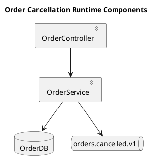

# Backend Design Template Reference

这是一份写作引导模板，不是固定格式。

使用原则：
- 可按项目复杂度裁剪章节；不适用内容必须写明“不适用 + 原因”，不采用“严格不删章节 / 缺失写 TBD”的 rigid schema
- 先从业务域边界、数据约束和接口实现链路出发，再谈框架和目录结构
- 模板强调“后端为什么这样分层、如何承接 contract”，不是泛泛列中间件名词
- 若项目不是典型 CRUD，也要把命令流、事件流或集成边界写清楚
- 图示使用 PlantUML source 写入 Markdown；不要求渲染图片入库，不使用 Mermaid 作为默认规则
- 不得把 `api-contract.md` 的接口定义复制一遍来替代实现映射

## 必答问题

1. 本次方案覆盖哪些业务域、服务边界和运行时组件？不覆盖什么？
2. 为什么选择当前架构模式：
   - layered、hexagonal、CQRS、modular monolith、microservice
3. `requirements.md` 的 Domain ID 如何映射到代码模块、聚合、Service？
4. `api-contract.md` 中每个接口如何落到实现链路：
   - controller / handler → service → repository → storage / external dependency
5. 数据模型如何支撑接口契约：
   - 表结构、约束、索引、审计字段、软删除、唯一性、状态机
6. 哪些操作需要事务，一致性边界在哪里，哪些地方接受 eventual consistency？
7. 哪些调用同步阻塞主流程，哪些通过事件、worker、cron 或 command handler 异步处理？
8. `api-contract.md` 中的 message / cron / cli / sdk contract 如何落到 producer / consumer / job / command handler？
9. 事务失败后如何补偿，幂等键来自哪里？
10. 认证、授权、租户隔离、PII、审计、滥用防护、依赖安全如何统一落地？
11. 与外部系统如何集成：
   - 重试、超时、幂等、补偿、降级
12. 哪些地方是高风险区域：
   - 热点查询、复杂事务、迁移风险、跨域编排、权限模型
13. 本方案对应的项目背景、现状痛点、本期目标和非目标是什么？
14. 本次是否涉及部署拓扑、MQ topic、worker、cron、外部依赖、跨团队依赖或上线风险？
15. 哪些问题仍未决，需要进入 Q&A / Open Questions？

## 推荐写法

可按以下顺序组织，也可按项目调整：

### 0. Document Metadata / 文档元信息

建议覆盖：
- 功能名称、平台 / 系统名称
- 前言：本文档用于指导开发、测试、部署与评审
- 修订历史
- 词汇表
- 关联文档：`requirements.md`、`tech-selection.md`、`api-contract.md`、spec

小项目可以合并文档元信息和背景章节，但不能省略设计边界。

### 1. Background / Scope / Goals

先用短段落写清：
- 项目背景、现状与痛点
- 本期目标
- 覆盖范围
- 非目标 / 不覆盖范围
- 关键假设与约束

### 2. Summary / Architecture Decisions

建议覆盖：
- 架构模式与核心理由
- 主要模块边界
- 技术栈依据
- 方案对比与最终取舍
- 明确不做的内容

### 2.1 System Boundary / Runtime Overview

复杂项目建议补充 PlantUML source，不要求渲染图片入库；简单项目可写“不适用 + 原因”。推荐图：System Boundary Diagram、Runtime Component Diagram、Service Interaction Sequence Diagram、ER style class diagram、Deployment Diagram。

建议说明：
- 业务入口
- 核心服务
- 基础设施
- 外部系统
- Runtime Component Diagram
- 关键流程 Sequence Diagram

每张图下方必须说明：范围、参与方、关键路径、异常路径、未覆盖范围、一致性检查。图中的 Service、Repository、Event、storage、external dependency 名称必须与本文表格一致。



### 3. Domain-to-Module Map

建议先把业务边界讲清，再写类名。

关键示例：

```markdown
| Domain ID | 业务域 | 代码模块 | 聚合 / 核心对象 | Core Service | Repository / Gateway |
|-----------|--------|----------|------------------|--------------|----------------------|
| D-ORD-001 | 订单管理 | modules/order | Order | OrderService | OrderRepository |
```

### 4. Data Model / Storage Design

每个核心模型建议回答：
- 为什么需要这张表或这个集合
- 主键、外键、唯一约束
- 状态字段与状态转移
- 索引依据来自哪些查询或过滤条件
- 审计字段和删除策略
- Data Lifecycle / Retention
- Migration / Backfill / Rollback

#### Data Lifecycle / Retention

```markdown
| 数据对象 | 敏感级别 | 保留周期 | 删除策略 | 脱敏/加密 | 审计要求 |
|---|---|---|---|---|---|
```

覆盖归档、PII 脱敏、删除恢复、保留周期、审计不可变、多租户隔离、敏感字段加密。小项目可合并到 Data Model，但需写明不适用项原因。

关键示例：

```markdown
### orders
- **用途**：保存订单主记录
- **关键约束**：`order_no` 唯一；`status` 仅允许 `pending|paid|shipped|cancelled`
- **索引**：
  - `idx_orders_user_id_created_at`：支撑“我的订单”按时间倒序查询
  - `idx_orders_status`：支撑后台状态筛选
```

### 5. Service Design

不要只列方法名，要说明：
- 方法职责
- 依赖
- 输入输出
- 事务边界
- 抛出的业务异常

关键示例：

```markdown
### OrderService.cancelOrder
- **职责**：校验状态、记录取消原因、回写订单状态
- **依赖**：OrderRepository, AuditLogService
- **事务边界**：单事务
- **异常**：
  - `ORDER_NOT_FOUND`
  - `ORDER_STATUS_CONFLICT`
```

### 6. Contract-to-Implementation Map

这是核心交付物之一。确保每个接口都有落点。

关键示例：

```markdown
| Contract | Handler / Controller / Consumer / Job / Command | Service | Repository / Gateway | Storage / External dependency | 副作用 |
|----------|--------------------------------------------------|---------|----------------------|-------------------------------|--------|
| POST /api/v1/orders/:id/cancel | OrderController.cancel | OrderService.cancelOrder | OrderRepository.updateStatus | orders | 写审计日志 |
```

### 6.1 Cross-Document Traceability Matrix

```markdown
| Domain ID | AC ID | Contract | Handler | Service | Repository / Gateway | Storage / External | Test Focus |
|---|---|---|---|---|---|---|---|
```

用于承接 `api-contract.md` 的 Domain ID、AC ID、Contract 和 Test Focus；若后续有 `frontend-design.md`，需能反查页面操作。

### 6.2 Test Focus / Verification Scenario

按 service method、transaction、event consumer、external dependency 生成测试关注点，便于后续 `ship-delivery-plan` 和 `ship-verify` 直接消费。

```markdown
| Domain ID | AC ID | Design Surface | Scenario | Expected Result | Evidence |
|---|---|---|---|---|---|
```

### 7. Transaction / Consistency / Idempotency

```markdown
| 操作 | 涉及聚合 | 事务边界 | 一致性要求 | 失败补偿 | 幂等策略 |
|---|---|---|---|---|---|
```

建议覆盖：
- 事务边界
- 一致性要求
- 失败补偿
- 幂等策略
- eventual consistency 接受范围

### 8. MQ / Domain Event / Worker / Cron

```markdown
| Topic / Queue / Event / Job | Producer | Consumer / Worker / Job | Payload schema | 触发事务点 | Outbox | Retry | DLQ | 幂等 key |
|---|---|---|---|---|---|---|---|---|
```

无 MQ、worker、cron 或异步事件时，写明“不涉及 MQ / 异步事件 + 原因”。

### 9. Service Interaction / External Integration

```markdown
| 调用方 | 被调用方 | 调用方式 | 超时 | 重试 | fallback / 降级 | error mapping |
|---|---|---|---|---|---|---|
```

建议覆盖外部系统、跨团队依赖、third-party API、SDK、内部服务调用和失败处理。

### 10. Cross-Cutting Concerns / Security Design

只写与当前方案真的相关的机制：
- authn
- authz
- tenant isolation
- PII / sensitive data
- audit
- abuse prevention
- dependency security
- validation
- error mapping
- structured logging
- tracing / metrics
- rate limiting
- cache
- background jobs / domain events

复杂项目建议单独写 Security Design，而不是只放在中间件清单中。

```markdown
| 主题 | 方案 | 作用范围 | 失败处理 | 验证点 |
|---|---|---|---|---|
| AuthN |  |  |  |  |
| AuthZ |  |  |  |  |
| Tenant isolation |  |  |  |  |
| Sensitive data / PII |  |  |  |  |
| Audit |  |  |  |  |
| Abuse prevention |  |  |  |  |
| Dependency security |  |  |  |  |
```

### 11. Read / Write Path Design

适用于 CQRS、搜索、Redis 缓存、报表宽表、高并发列表查询。

```markdown
| 场景 | 写模型 | 读模型 | 缓存 | 索引 | 一致性延迟 |
|---|---|---|---|---|---|
```

### 12. Deployment / Operations / Reliability

建议覆盖：
- 部署拓扑
- migration 工具与命名约定
- rollout / rollback
- migration 执行流程
- 外部依赖失败时的重试与超时
- 观测指标和告警
- 敏感数据、审计、合规策略
- observability：QPS、latency、error rate、queue lag、job duration、DLQ count
- capacity：数据量、并发量、热点查询、缓存命中预期
- alerting：按业务风险写初始阈值，或说明无法确定
- 降级与恢复策略

无部署变更时，写明“沿用现有部署拓扑 + 原因”。

### 13. Risk / Dependencies / Q&A

建议最后收束：
- 风险评估
- 跨团队 / 外部系统依赖
- Open Questions
- Q&A

### 14. Ready Checklist

建议在文末逐项确认：
- 接口映射是否全覆盖
- 数据模型是否支撑 contract
- 事务、一致性、补偿、幂等是否明确
- 安全与横切关注点是否覆盖
- 部署、迁移、rollback、observability 是否有结论
- stage_status 是否可切到 `ready`

## 裁剪规则

- 纯内部 worker 或 batch 任务可弱化 controller 层，但必须保留输入边界和失败处理
- 无数据库场景可把数据模型改写成 external storage / third-party API contract
- 小项目可以合并文档元信息和背景章节，但不能省略设计边界
- 小项目可以把 “Summary + Domain Map” 合并，但不要省略实现链路
- 小项目可以合并 Diagrams、Transaction / Consistency、Traceability 表格，但需保留结论或写明不适用原因
- 没有缓存或限流需求时，显式写“本期不引入 + 原因”
- 无 MQ、worker、cron 或异步事件时，显式写“不涉及 MQ / 异步事件 + 原因”
- 无部署变更时，显式写“沿用现有部署拓扑 + 原因”

## 常见空话警报

- “采用分层架构，职责清晰” 但没有写出每层实际边界
- “数据库按需建表” 但没有从 contract 反推字段与索引
- “统一异常处理” 但没有错误到 API 响应的映射规则
- “接口实现参考 api-contract.md” 但没有写出 Handler / Service / Repository / Storage / External dependency 链路
- “后续再考虑事务和权限” 这通常意味着后面会重构主链路
