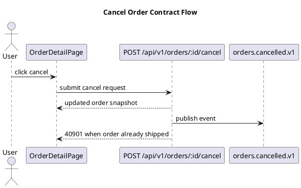

# API Contract Template Reference

这是一份写作引导模板，不是固定格式。

使用原则：
- 先基于 `requirements.md`、`tech-research.md`、`tech-selection.md` 和相关设计输入做判断，再决定文档结构
- 必须消费 `tech-research.md` 的 Requirement-to-Reality Mapping 和 Existing Surface Inventory；已有 API / message / cron / cli / sdk surface 不能被默认忽略或重复新建
- 优先回答关键设计问题，而不是机械填章节
- 若项目采用 GraphQL / tRPC / gRPC，可把“接口”改写为 operation / procedure / method，但保留同等粒度的信息
- 若某部分不适用，写明“不适用 + 原因”，不要静默省略

## 必答问题

1. 这份契约要服务哪些调用方，为什么当前 API 风格最合适？
2. 全局约定是什么：
   - base URL / versioning / auth / idempotency / time format / pagination / sorting / filtering
3. 每个业务域分别暴露哪些操作，这些操作分别对应哪些 AC ID 和页面？
4. 每个操作的输入边界是什么：
   - path / query / header / body 字段、类型、必填、校验、默认值、空值语义
5. 每个操作的输出边界是什么：
   - 成功结构、空结果、分页结构、异步结果、字段含义、可为空字段
6. 失败路径如何表达：
   - HTTP status、business error code、message、details、前端处理建议、是否可重试
7. 哪些数据结构是共享模型，哪些是接口专属模型？
8. 是否存在跨接口业务流程、状态迁移或异步链路需要 PlantUML 图示辅助评审？若不画图，原因是什么？
9. 每个 contract 的 provider、consumer、entrypoint、调用时机是否明确？这同样适用于 REST、gRPC、message、cron、cli、sdk。
10. 状态 enum 是否定义了合法迁移、非法迁移错误和新增 enum 值的 consumer 兼容处理？
11. 写操作、message、cron、CLI 副作用命令的幂等与重试边界是什么？
12. 契约中有哪些假设、兼容性约束、机器可读产物路径和潜在变更点？
13. `tech-research.md` 中已有 surface 的处理结论是什么：兼容扩展、breaking、deprecation、avoid、new 还是 unknown？

## 推荐写法

可按以下顺序组织，也可按项目调整：

### 1. Summary / Key Decisions

先用短段落写清：
- 契约覆盖范围
- API 风格与原因
- 本文的关键设计决策
- 与已有 API / message / cron / cli / sdk surface 的关系
- 明确不包含的范围

### 1.1 Consumer / Provider Matrix

用于统一 REST、gRPC、message、cron、cli、sdk 的调用关系。小项目可合并到 Summary，但不能静默省略调用方边界。

```markdown
| Contract | Provider | Consumer | Entrypoint | AC ID | 调用时机 | 是否阻塞主流程 |
|---|---|---|---|---|---|---|
```

### 1.1.1 Existing Surface Compatibility

把 `tech-research.md` 的现有 surface 映射到本契约决策。

```markdown
| Existing Surface | Source Evidence | Required Change | Compatibility | Decision | Risk / Follow-up |
|---|---|---|---|---|---|
```

### 1.2 Diagrams / Visual Aids

复杂项目建议补充 PlantUML source，不要求渲染图片入库。推荐用 sequence diagram 表达业务调用顺序，用 state diagram 表达状态迁移，用 activity diagram 表达异常分支。



每张图下方必须说明：范围、参与方、关键路径、异常路径、未覆盖范围、一致性检查。图中的 contract、event、task、command、state 名称必须能在本文表格中找到。

### 2. Global Conventions

建议至少覆盖：
- URL / versioning 规则
- auth 方式与权限上下文
- 通用请求头与响应 envelope
- idempotency、幂等冲突、并发控制
- 分页 / 排序 / 过滤 / 搜索 / 日期范围规范
- 时间、货币、枚举、空值和时区约定

机器可读产物建议记录 owner 和路径，例如：
- OpenAPI: `docs/contracts/openapi.yaml`
- JSON Schema: `docs/contracts/schemas/*.schema.json`
- Zod: `src/contracts/*.schema.ts`
- proto: `proto/<domain>/v1/*.proto`
- Avro: `schemas/<domain>/*.avsc`

关键示例：

```json
{
  "code": 0,
  "message": "ok",
  "data": {}
}
```

### 3. Domain Contract Blocks

按业务域分组，不按 HTTP method 平铺。每个接口块建议至少包含：
- 描述
- 关联 AC
- 关联页面 / 调用方
- 请求字段表
- 成功响应示例
- 错误响应表
- 权限 / 幂等 / 缓存 / 限流等特殊约束

关键示例：

```markdown
#### POST /api/v1/orders/:id/cancel
- **描述**：取消订单
- **关联 AC**：AC-ORD-004
- **关联页面**：OrderDetailPage
- **前置条件**：订单状态必须为 `pending`
- **请求参数**：
  | 位置 | 字段 | 类型 | 必填 | 校验 | 说明 |
  |------|------|------|------|------|------|
  | path | id | string | 是 | UUID | 订单 ID |
  | body | reason | string | 否 | max 200 | 取消原因 |
- **成功响应**：返回最新订单快照
- **错误响应**：
  | 错误码 | HTTP Status | 条件 | 前端处理 |
  |--------|-------------|------|----------|
  | 40901 | 409 | 订单已发货 | 刷新页面并提示不可取消 |
```

### 3.1 gRPC Service Contract（如选了 `grpc`）

按 service 分组，不按 method 平铺。每个 service 块建议至少包含：
- service 名称与职责
- proto 文件位置（建议指向仓库内的 `.proto` 文件路径，避免在本文重复 schema）
- 每个 method 的：流式模式、关联 AC、关联调用方、超时与 deadline、重试策略、幂等性

关键示例：

```markdown
#### OrderService

- **proto 文件**：`proto/order/v1/order.proto`
- **职责**：订单生命周期管理，供内部 checkout 与 fulfillment 服务调用

##### `rpc CancelOrder(CancelOrderRequest) returns (CancelOrderResponse)`

- **流式模式**：unary
- **关联 AC**：AC-ORD-004
- **关联调用方**：CheckoutService、AdminConsoleService
- **超时**：客户端 deadline 默认 3s；服务端最大处理 2.5s
- **重试**：客户端可对 `UNAVAILABLE` / `DEADLINE_EXCEEDED` 重试，最多 2 次，指数退避起步 100ms
- **幂等性**：基于 `request_id` 字段去重，TTL 24h
- **错误码**：
  | gRPC code | 业务条件 | 调用方处理 |
  |-----------|---------|-----------|
  | FAILED_PRECONDITION | 订单已发货 | 提示用户刷新 |
  | NOT_FOUND | 订单不存在 | 检查 ID 来源 |
```

### 3.2 消息契约（如选了 `message`）

按 topic / queue 分组。每个消息块建议至少包含：
- topic / queue 名与传输介质（Kafka / RabbitMQ / SQS / Pub-Sub 等）
- 生产者与消费者清单
- payload schema（建议引用仓库内 schema 文件，避免重复）
- 分区键 / 路由键策略
- 幂等键与去重 TTL
- 重试策略（次数、退避、死信处理）
- 消息顺序保证级别（无序 / 分区有序 / 全局有序）
- 关联 AC

关键示例：

```markdown
#### topic: `orders.cancelled.v1`

- **介质**：Kafka
- **生产者**：OrderService
- **消费者**：FulfillmentService、NotificationService、AnalyticsPipeline
- **关联 AC**：AC-ORD-004、AC-NOTIF-002
- **payload schema**：`schemas/orders/cancelled-v1.avsc`
- **分区键**：`order_id`（保证同一订单的事件分区有序）
- **幂等键**：`event_id`（UUID v7），消费端去重 TTL 7 天
- **重试策略**：消费失败重试 3 次，退避 1s/5s/30s；超出后转入 DLQ `orders.cancelled.v1.dlq`
- **顺序保证**：分区有序
- **schema 演进**：仅允许向后兼容（新增可选字段）；不兼容变更必须发布 `v2` 新 topic
```

### 3.3 定时任务契约（如选了 `cron`）

按任务名分组。每个任务块建议至少包含：
- 任务名与负责模块
- 触发表达式（cron / interval / 事件驱动）
- 输入源（DB 查询 / 文件 / 上游 topic / API 拉取）
- 输出去向（DB 写入 / 文件落盘 / 下游 topic / 通知）
- 并发控制（单例 / 多实例 / 分片）
- 超时与失败补偿
- 关联 AC

关键示例：

```markdown
#### task: `daily-order-reconciliation`

- **负责模块**：BillingService
- **触发**：cron `0 3 * * *`（每日 03:00 UTC）
- **关联 AC**：AC-BILL-007
- **输入源**：`orders` 表（前一日已完成订单） + `payments` 表（前一日成功扣款）
- **输出**：`reconciliation_report` 表写入；异常项推送 topic `billing.reconciliation.alert.v1`
- **并发控制**：分布式锁单例（key: `cron:daily-order-reconciliation`，TTL 2h）
- **超时**：90 分钟；超时自动释放锁并告警
- **失败补偿**：失败后 30 分钟内自动重试一次；二次失败转人工，写入 `reconciliation_failures` 表
- **幂等性**：按 `(date, order_id)` 去重，重复执行不重复落账
```

### 3.4 CLI 接口契约（如选了 `cli`）

按命令树组织。每个命令块建议至少包含：
- 命令路径（含父命令）
- 用途与典型场景
- 参数定义（位置参数、选项、必填/可选、默认值）
- 输入约定（stdin 格式）
- 输出约定（stdout 格式：纯文本 / JSON / 表格）
- 退出码语义
- 环境变量依赖
- 关联 AC

关键示例：

```markdown
#### `myapp orders cancel <order-id>`

- **用途**：取消指定订单
- **关联 AC**：AC-ORD-004
- **参数**：
  | 名称 | 位置/选项 | 必填 | 默认 | 说明 |
  |------|-----------|------|------|------|
  | order-id | 位置参数 1 | 是 | — | 订单 UUID |
  | --reason | 选项 | 否 | "" | 取消原因，最长 200 字 |
  | --force | 选项 | 否 | false | 跳过状态前置检查 |
  | --output | 选项 | 否 | text | text \| json |
- **stdin**：不读取
- **stdout**：成功输出最新订单快照（text 或 json）
- **stderr**：错误信息（人类可读）
- **退出码**：
  | code | 含义 |
  |------|------|
  | 0 | 成功 |
  | 1 | 通用失败 |
  | 2 | 参数错误 |
  | 3 | 订单不存在 |
  | 4 | 状态不允许取消（除非 `--force`） |
- **环境变量**：`MYAPP_API_URL`、`MYAPP_TOKEN`
```

### 3.5 内部 SDK 契约（如选了 `sdk`）

按公开 API 表面组织。建议至少覆盖：
- 公开符号清单（类、函数、常量、类型）—— 未列出即视为私有
- 每个公开 API 的：签名、参数语义、返回值语义、抛出的异常 / 返回的错误
- 版本策略（SemVer / CalVer）
- breaking change 政策（是否允许 minor 引入破坏；deprecation 周期长度）
- 兼容性测试边界

关键示例：

```markdown
#### `class OrderClient`

- **包路径**：`@myorg/order-sdk`
- **公开方法**：`cancel(orderId: string, options?: CancelOptions): Promise<Order>`
- **关联 AC**：AC-ORD-004
- **参数**：
  - `orderId`：必填，UUID v4
  - `options.reason`：可选，string，最长 200 字
  - `options.idempotencyKey`：可选，string；不传则 SDK 自动生成
- **返回**：取消后的最新 `Order` 快照
- **抛出**：
  | 异常类 | 触发条件 |
  |--------|---------|
  | `OrderNotFoundError` | 订单不存在 |
  | `OrderStateError` | 订单状态不允许取消 |
  | `NetworkError` | 传输层失败（已重试 3 次） |
- **版本策略**：SemVer；breaking change 仅允许在 major 版本引入
- **deprecation 周期**：minor 版本标记 `@deprecated` 后，至少保留 2 个 minor 版本再删除
```

### 4. Shared Models

建议明确：
- 共享 DTO / schema / enum
- 字段来源与复用范围
- 哪些字段允许 `null`
- API 命名与持久化命名的映射规则

### 5. Error Model

建议按“用户可处理 / 业务冲突 / 权限问题 / 系统故障”分层整理，而不是只列数字。

关键示例：

```markdown
| 错误码 | HTTP/gRPC Code | 触发条件 | 用户可恢复 | 是否可重试 | 前端处理 | 后端日志级别 |
|---|---|---|---|---|---|---|
| 40901 | 409 / FAILED_PRECONDITION | 订单已发货 | 是 | 否 | 刷新页面并提示不可取消 | info |
```

### 5.1 State Contract

有状态对象建议显式列出 enum、合法迁移、非法迁移错误和新增状态值的兼容处理。复杂状态流可补充 PlantUML state diagram。

```markdown
| 对象 | 当前状态 | 允许迁移到 | 触发 contract | 非法迁移错误 | 兼容性说明 |
|---|---|---|---|---|---|
```

### 5.2 Idempotency / Retry Contract

适用于写接口、message consumer、cron / batch、CLI 副作用命令。

```markdown
| Contract | 幂等要求 | 幂等键来源 | 重复请求行为 | 超时后是否可重试 | 冲突响应 |
|---|---|---|---|---|---|
```

### 6. Change Impact / Open Questions

建议记录：
- 兼容性策略
- 变更分类：breaking / non-breaking / additive
- 新增 response 字段默认 optional，或说明 consumer 兼容性
- 新增 request 必填字段通常是 breaking change
- enum 新增值可能破坏前端 switch exhaustiveness，必须提示默认处理
- error code 新增需要前端默认 fallback
- message topic 不兼容变更必须发布 `v2` topic
- SDK public API deprecation 周期
- 预期高变更区域
- 暂存假设
- 后续若接口调整，前端和后端各受什么影响

### 6.1 Traceability Matrix

contract template 不要求提前填完 backend/frontend 细节，但必须为下游补齐实现路径和页面路径预留追踪关系。

```markdown
| Domain ID | AC ID | Contract | Consumer / Entrypoint | Shared Model / Error Code | Test Focus |
|---|---|---|---|---|---|
```

下游 `backend-design.md` 应补齐 Handler / Service / Repository / Storage，`frontend-design.md` 应补齐 Page / User Action / State / Error UX。

### 6.2 Test Focus / Verification Scenario

按 contract operation / event / task / error code 生成测试关注点，便于后续 `ship-delivery-plan` 和 `ship-verify` 直接消费。

```markdown
| Domain ID | AC ID | Design Surface | Scenario | Expected Result | Evidence |
|---|---|---|---|---|---|
```

### 7. Verification Snapshot

简要汇总：
- Domain 覆盖情况
- AC / 页面关联完整度
- 未闭合风险
- stage_status 是否可切到 `ready`

## 裁剪规则

- 小项目可以合并 “Summary + Global Conventions”
- 小项目可以把 Consumer / Provider Matrix、Traceability Matrix 合并到接口清单，但需保留字段含义或写明不适用原因
- 简单项目不强制画图；复杂项目若不画图，应写明原因
- GraphQL / tRPC 项目可以把“接口清单”写成 query / mutation / procedure 清单
- 没有分页场景时，可显式写“本期无分页接口”
- 没有公开 API 时，仍要写明调用方边界，例如 Web app / internal admin / worker

## 常见空话警报

- “接口遵循 RESTful 规范” 但没有解释资源边界
- “错误统一处理” 但没有错误码和差异化处理建议
- “数据模型见实现” 这会破坏 Contract-First
- “字段含义自解释” 这通常意味着含义并不清晰
