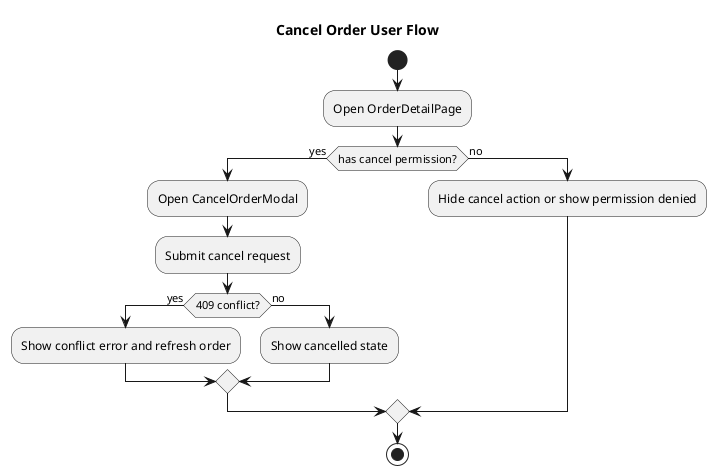

# Frontend Design Template Reference

这是一份写作引导模板，不是固定格式。

使用原则：
- 设计稿、原型图、截图、设计系统是事实源；没有视觉证据时不要凭空补全页面
- 先说明页面和用户操作，再说明组件、状态和接口映射
- 模板强调“页面如何落地”，不是泛泛讲前端技术栈
- 若某部分不适用，写明“不适用 + 原因”，不要静默省略

## 必答问题

1. 本次方案覆盖哪些页面、流程和用户角色？不覆盖什么？
2. 每个页面的视觉事实源是什么：
   - Figma、截图、设计系统、线框图、交互说明
3. 每个页面视觉证据等级是什么，哪些交互或状态缺失？低证据等级是否被明确标记为假设？
4. 页面树是否完整覆盖 requirements.md 的用户路径、异常路径与权限路径？复杂用户流是否需要 PlantUML 图示辅助评审？
5. 每个页面由哪些组件构成，组件分层依据是什么？
6. 每个关键组件的数据从哪里来：
   - props、local state、global store、server state、URL state
7. URL state、local state、server state、global app state、derived state 分别由谁拥有？
8. 每个用户操作会触发什么：
   - UI 变化、状态变更、接口调用、跳转、toast、empty/error state
9. 每个关键页面的 loading / empty / error / permission / offline 状态如何表现？
10. contract 错误码如何映射到 UI 反馈？
11. 页面与 `api-contract.md` 的映射是否闭环：
   - 无幽灵接口、无未消费接口
12. 路由、权限、加载态、错误态、响应式、无障碍如何落地？
13. 哪些地方是高风险区域：
   - 复杂表单、并发请求、长列表、跨页面共享状态、设计稿信息不足

## 推荐写法

可按以下顺序组织，也可按项目调整：

### 1. Summary / Scope

先用短段落写清：
- 本文覆盖的页面或功能流
- 关键实现策略
- 与设计稿的一致性原则
- 明确暂不处理的范围

### 2. UI Evidence Index

建议先列证据，而不是直接下结论：
- 页面 ID
- 设计链接 / 截图路径
- 对应 user flow
- 缺失信息与采用的假设

### 2.1 Design Evidence Quality

证据等级：
- `high`：Figma final design / design system / 完整交互说明
- `medium`：截图 / 原型 / 局部设计稿
- `low`：wireframe / 用户口述 / 暂存假设

低证据等级不能假装已定稿，必须列出缺失信息和采用假设。

```markdown
| 页面 | 证据等级 | 来源 | 缺失信息 | 采用假设 |
|---|---|---|---|---|
```

### 3. Page Tree / Flow Map

建议把正常流、异常流、权限流都写出来。

关键示例：

```text
/orders              → OrderListPage     (登录)
/orders/:id          → OrderDetailPage   (登录)
/orders/:id/cancel   → CancelOrderModal  (登录, 仅待取消状态可见)
```

### 3.1 Diagrams / Visual Aids

复杂项目建议补充 PlantUML source，不要求渲染图片入库。推荐图：User Flow activity diagram、Page/API sequence diagram、Frontend state/component flow diagram。图示不替代 UI evidence。

每张图下方必须说明：范围、参与方、关键路径、异常路径、权限路径、未覆盖范围、一致性检查。图中的页面、用户操作、状态、接口必须与 Page Tree、Page-API Mapping、UI State Matrix 一致。



### 4. Component Architecture

按页面组织比按目录组织更有用。每个关键组件建议回答：
- 组件职责
- 所属层级（atom / molecule / organism / template / page）
- 数据来源
- 对外暴露的 props / events
- 依赖的 hooks / store / query
- 是否复用，复用边界在哪里

关键示例：

```markdown
### OrderListToolbar
- **层级**：molecule
- **职责**：承载搜索、筛选、排序入口
- **数据来源**：
  - URL state: `keyword`, `status`
  - callback props: `onFilterChange`
- **不负责**：直接发起 API 请求
```

### 5. Page-API Mapping

这是核心部分。不要只写“页面调用哪些接口”，要写“什么操作在什么时机以什么参数调用接口，成功和失败分别怎么反馈”。

关键示例：

```markdown
| 页面 | 用户操作 | 触发时机 | 调用接口 | 请求参数 | 成功反馈 | 失败反馈 |
|------|----------|----------|----------|----------|----------|----------|
| OrderDetailPage | 取消订单 | 点击确认 | POST /api/v1/orders/:id/cancel | { id, reason } | 刷新详情，状态改为 cancelled | 保持弹窗，展示冲突提示 |
```

### 5.1 Page-to-Contract Bidirectional Coverage

```markdown
| 页面操作 | 使用接口 | contract 是否存在 | 错误码是否覆盖 | loading/empty/error 是否设计 |
|---|---|---|---|---|
```

同时检查页面调用未定义接口，以及 `api-contract.md` 中面向前端的 contract 是否无人使用；非前端 consumer 需说明。

### 5.2 Cross-Document Traceability Matrix

```markdown
| Domain ID | AC ID | Contract | Frontend Page/Action | UI State / Error UX | Test Focus |
|---|---|---|---|---|---|
```

### 5.3 Test Focus / Verification Scenario

按 page action、UI state、permission UX、error UX 生成测试关注点，便于后续 `ship-delivery-plan` 和 `ship-verify` 直接消费。

```markdown
| Domain ID | AC ID | Design Surface | Scenario | Expected Result | Evidence |
|---|---|---|---|---|---|
```

### 6. State / Data Flow

建议区分：
- local UI state
- global app state
- server state cache
- URL state
- derived state

重点写清：
- 谁拥有状态
- 谁更新状态
- 什么状态需要持久化
- 什么状态绝不能做成全局

### 6.1 UI State Matrix

至少提示 initial、loading、empty、error、partial success、optimistic、permission denied、offline；不适用项写明原因。

```markdown
| 页面 | 状态 | 触发条件 | UI 表现 | 可执行操作 |
|---|---|---|---|---|
```

### 6.2 Frontend Data Ownership

```markdown
| 状态 | Owner | 存储位置 | 更新来源 | 是否持久化 | 不变量 |
|---|---|---|---|---|---|
```

### 7. Routing / Permission / UX Edge Cases

至少覆盖：
- route guard
- 401 / 403 / 404
- loading skeleton / empty state / error retry
- unsaved changes
- responsive behavior
- keyboard / screen-reader accessibility

### 7.1 Permission UX

覆盖未登录、无权限、数据不可见、操作被禁用、资源不存在但不能泄露存在性。

```markdown
| 权限场景 | 页面/组件表现 | 接口错误 | 前端处理 |
|---|---|---|---|
```

### 8. Non-Functional Decisions

只写与本项目相关的决策，例如：
- 首屏性能优化
- 长列表虚拟化
- 图片加载策略
- SSR / CSR / SSG 选择
- 埋点与行为追踪

### 8.1 Accessibility / Responsive Detail

不要只写“语义化 HTML、ARIA”。关键页面和关键组件需要落到可检查的行为。

```markdown
| 页面/组件 | Keyboard | Screen Reader | Focus | Contrast | Mobile Behavior |
|---|---|---|---|---|---|
```

重点覆盖 Modal、Dropdown、Table、Form、Toast、Date picker、Drag and drop 等关键组件。

### 8.2 Analytics / Performance Budget / Accessibility Tests

- Analytics events：关键页面进入、关键操作提交、失败原因、转化漏斗
- Performance budget：首屏、交互延迟、列表渲染规模、bundle 分包
- Accessibility tests：键盘路径、focus trap、screen reader label、contrast

### 9. Risk / Verification

建议最后收束：
- 设计证据是否齐全
- 页面与接口是否双向覆盖
- 当前风险和待确认项
- stage_status 是否可切到 `ready`

## 裁剪规则

- 小型管理台项目可合并 “Summary / UI Evidence / Page Tree”
- 单页功能可弱化页面树，但不能省略用户操作到接口的映射
- 小项目可以合并 Diagrams、UI State Matrix、Data Ownership、Permission UX，但需保留结论或写明不适用原因
- 无 SEO 场景可显式写“本期无 SSR / SEO 需求”
- 无设计系统时，必须说明采用的临时组件规则或 wireframe 假设

## 常见空话警报

- “采用组件化开发” 但没有组件边界和复用规则
- “状态管理使用最合适方案” 但没有解释谁拥有状态
- “按接口返回渲染” 但没有写 loading / empty / error 分支
- “页面按设计稿实现” 但没有索引任何设计证据
